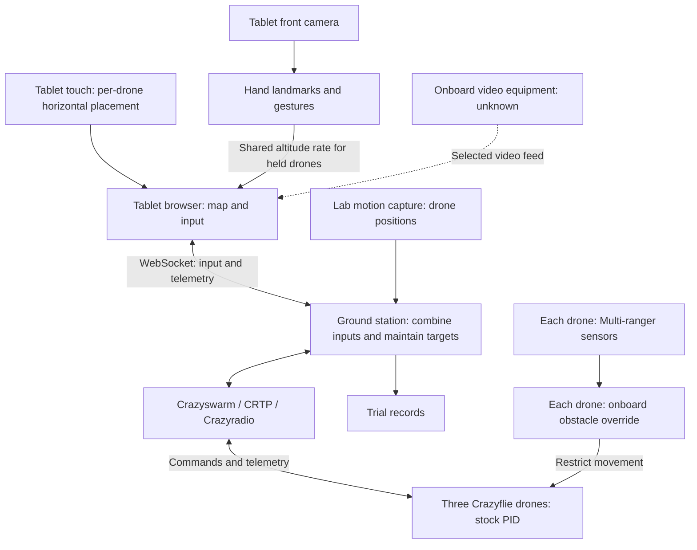

# Touch and vision multi-drone control

This thesis studies one operator controlling three indoor drones through a tablet.
Touch sets each held drone's horizontal position. The tablet camera reads hand gestures that set their shared climb or descent rate. [1][1]

This document defines the thesis requirements, evaluation, decisions, unresolved questions, and shared terms.
For software architecture, dependencies, setup, and tests, read [README.md](README.md).

## Source baseline and review

**Review date: 17 September 2026.** The baseline is the complete, 113-page local PDF of the June 2026 proposal.
Its title is *Capacitive Touch and Computer Vision-Based Interface for Multi-Drone Positioning and Altitude Flight System*.
The review covered the complete Markdown export and the original Google Doc, including its single tab and tables. [1][1]

The Google Doc reports a modification time of **3 September 2026, 15:15:35 UTC**.
The PDF records no creation or modification date. The Markdown records no revision identifier.
The cover date alone does not establish which export is newer.
Text comparisons accounted for list numbering, equations, and table extraction order. They found no requirement changes between the three sources.

The PDF supplies the visual baseline. The Markdown omits the drawings for Figures 3 and 8 but retains their captions.
The PDF review covered all eight figures, notation, table headers, continued rows, units, and notes.
The review did not compare live Google Doc image pixels with the PDF. All reviewed PDF content was readable without optical character recognition (OCR).

**Citation convention:** `PDF p.` means the physical page, counting the cover as page 1.
Printed page labels generally match, but physical page 112 prints `2`. Contents lists and comment tables also contain outdated page references.
Use the physical page locations below. Section headings identify the same material in Google Docs and Markdown.

| Reviewed material | Physical PDF pages | Coverage |
|---|---|---|
| Front matter | 1–11 | Cover, abstract, contents, figure/table lists, acronyms, notation, glossary, and the empty Listings placeholder. |
| Introduction, §1.1–1.6 | 12–33 | Background, prior studies, PS1–PS3, objectives, Table 1, significance, assumptions, scope, and delimitations. |
| Design and components, §1.7.1–1.7.3 | 33–43 | Research design, architecture, hardware, software, communication, and Figures 1–4. |
| Evaluation, §1.7.4–1.7.8 | 43–63 | Metrics, participants, expert criteria, course, Figures 5–7, procedures, data collection, and analysis. |
| Schedule, budget, and overview, §1.8–1.9 | 63–74 | All four Gantt charts, their notes, and Table 2. |
| Literature review, §2.1–2.3 | 75–98 | Theory, empirical studies, gaps, Tables 3–4, and conceptual Figure 8. |
| References and review responses | 99–113 | Complete bibliography, panel-response table, and Post-Defense Comments. |

There is no standalone appendix in these sources. The schedule mentions an Appendix V form but does not include it.
Chapters after Chapter 2 are future work. The bibliography review did not independently check every cited study.

Use these labels to identify what supports a statement:

- **Proposal requirement:** The proposal requires this behavior or study procedure. Its numerical targets remain unmeasured.
- **Accepted project decision:** The project supplied this later choice separately from the proposal.
- **Recommendation:** This suggestion needs a project decision before adoption.
- **Interpretation:** This explanation derives from the source and states its limits.
- **Unknown or conflict:** Information is missing or sources disagree.
- **Verified implementation result:** Project test evidence supports this result. This review establishes none.

## Research purpose and scope

**Proposal purpose.** Problem statement 1 (PS1) concerns the equipment and skill needed for multi-drone control.
PS2 concerns losing direct position control when operators assign tasks instead of movement targets.
PS3 concerns the lack of a separate altitude channel.
The general objective combines a working interface with a comparison against a conventional controller. [1][1], §1.3–1.4, PDF pp. 16–25.

The contribution is simultaneous, continuous touch positioning and camera-based altitude input for several physical drones.
The literature review distinguishes this combination from waypoint interfaces, group gestures, and wearable hand tracking.
The novelty claim covers only the reviewed studies. Figure 8 compares concepts without experimental data.
The proposal contains no separate research-question list or formal null or alternative hypotheses. [1][1], §2.1–2.3, PDF pp. 75–98.

**REQ-01: Proposal requirement: operating scope.** One operator controls three Crazyflie 2.1 drones with one tablet in Miguel 409 Drone Research Laboratory.
The tablet stays upright in landscape orientation, with the camera's vertical axis aligned with hand movement.
Motion capture supplies drone positioning. The accessibility claim concerns input equipment. The system still needs laboratory infrastructure. [1][1], §1.6, PDF pp. 28–33.

The study excludes outdoor/GPS trials, autonomous navigation, path planning, AI placement decisions, map zoom, satellite imagery, and multi-floor maps.
It does not compare three simultaneous video panels or test changing/outdoor lighting, distance-dependent communications, cybersecurity, or interference resistance.
The planned evaluation covers three drones. Larger fleets and outdoor altitude scaling remain proposals for future research. [1][1], §1.6.3, PDF pp. 30–33.

**Proposal assumptions.** Participants can coordinate touch and the free hand after orientation.
The assumptions treat the lab as representative of the experiment and radio and motion capture as sufficiently stable.
They also assume that markers and decks affect the three drones similarly.
First-time university participants support an initial usability study. These assumptions do not establish reliability or general population results. [1][1], §1.6.1, PDF pp. 28–29.

## System components and responsibilities

The following rows describe the **proposal design**. Equipment installation remains unverified. [1][1], §1.7.2–1.7.3, PDF pp. 35–43.

| Component | Responsibility |
|---|---|
| Tablet web interface | Reads separate touch contacts. Shows the fixed map, labeled drone entities, hand-camera view, altitude information, and one selected video feed. |
| Tablet front camera and computer vision | Finds the operator's hand and wrist. Recognizes deliberate activation and lock gestures. It does not track drone positions. |
| Ground station | Combines horizontal and altitude input, maintains commands, and connects the browser through WebSocket messages. |
| Crazyswarm, CRTP, and Crazyradio | Dispatch addressed drone commands. CRTP is the drone communication protocol. WebSocket is the browser-to-host connection. |
| Laboratory motion capture | Tracks reflective markers to supply drone positions for control, the live map, and accuracy logging. It does not read the operator's hand. |
| Three Crazyflie 2.1 drones | Follow smoothed, rate-limited setpoints, or movement targets. Stock cascaded PID controllers stabilize the drone and follow those targets. Each drone has its own radio address. |
| Multi-ranger deck on each drone | Measures nearby obstacles and supplies proximity-ring data. Onboard logic must override unsafe movement. |
| Onboard video equipment | Supplies a view from the operator-selected drone. Camera hardware, transport, and receiver are unspecified. |
| Trial recorder | Records commands, measured positions, telemetry, events, and timing for evaluation. |

**Interpretation diagram.** This summarizes the proposal responsibilities. See the [decision register](#accepted-decisions-made-after-the-proposal) for later software choices.
The video line does not specify a transport or imply that video passes through Crazyradio.

**External findings, checked 17 September 2026.** These findings explain component capabilities. They do not add thesis requirements:

- Bitcraze documents five Multi-ranger directions: front, back, left, right, and up. There is no downward sensor on this deck. [3][3]
- Its advertised range is up to 4 m and depends on surface and lighting conditions. Stopping distance requires a separate measurement. [3][3]
- MediaPipe Gesture Recognizer returns gesture labels and hand landmarks. Built-in labels include `Open_Palm` and `Closed_Fist`. [5][5]
- Bitcraze's commander checks the age of streamed setpoints. Stopping the stream can trigger stabilization and eventual motor shutdown. [4][4]
- Bitcraze offers separate camera/Wi-Fi hardware through the AI deck. The project has not selected a camera. [6][6]

## Required interactions and control behavior

Each row is a **proposal requirement**, except where a later decision or interpretation is explicit.

| Label | Behavior | Source location [1][1] |
|---|---|---|
| REQ-02 | Each finger holds one drone entity. Each held drone follows its own continuous horizontal drag. One, two, or three drones can be held together. | §1.7.2, pp. 35–37, “each producing its own continuous horizontal position setpoint.” |
| REQ-03 | A deliberate open-palm activation captures the wrist's vertical position as the neutral point. A resting hand must not activate altitude control. | §1.7.3.6, Figure 4 and prose, pp. 40–42. |
| REQ-04 | Vertical displacement from neutral sets a proportional climb/descent rate, limited by a maximum rate. Every held drone receives the same rate. Altitude targets stay within the usable motion-capture volume. Separate targets preserve altitude offsets during unrestricted movement. | §1.7.2, p. 36, “both climb or descend together at the same rate.” §1.7.3.6, p. 41. |
| REQ-05 | A closed fist engages altitude lock and discards the neutral point. The next deliberate activation captures a fresh neutral point. | Figure 4 and §1.7.3.6, pp. 40–42. |
| REQ-06 | Hand loss during active control holds the last commanded altitude. Reappearance alone does not resume altitude changes. The operator must activate the gesture again. | §1.7.3.6, p. 42, “reacquisition requires a new gesture activation.” |
| REQ-07 | A released drone hovers in X, Y, and Z. Later hand movement does not affect it until it is held again. | §1.6.2, pp. 29–30. §1.7.2, pp. 36–37. |
| REQ-08 | During course trials, the interface rejects drags into the restricted zone. This is a horizontal restriction without a height exception. The course restriction does not apply to separate gesture sub-tests. | §1.7.3.5, pp. 39–40. §1.7.6, pp. 53–56. |
| REQ-09 | Show one operator-selected onboard video feed at a time, plus the hand-camera view and live map. Show proximity-ring segments from range readings. Video switching must not redefine held drones. | §1.6.3, pp. 31–32. §1.7.3.5, pp. 39–40. How touch selects the video feed is the accepted project decision DEC-08 in [2][2]. |
| REQ-10 | Each drone stops translation and enters defensive hover when an onboard range threshold is breached. This override takes precedence over streamed movement. The proposal permits recovery when the obstacle clears or the operator commands movement away. | §1.7.3.2, p. 38. §1.7.3.7, p. 43. Implementation details remain open. |
| REQ-11 | Retain stock cascaded PID control and supply smoothed, rate-limited setpoints. The project accepts additional obstacle-stop firmware. Stock support for REQ-10 remains unproven. | §1.7.3.7, pp. 42–43, and [2][2]. |
| REQ-12 | Release a reproducible public build with source code across the input/communication path. Include a bill of materials, configuration steps, and a setup manual. | SO6 and Table 1, pp. 22–25. This is a future deliverable. |

**Interpretation.** A stationary hand above neutral continues to request a climb. It does not request one absolute height.
Touch ownership is per drone. Gesture state is shared. Defensive hover is a separate onboard override.
Altitude lock and hand loss stop altitude changes, while released drones hold all three position axes.
The proposal does not specify that hand loss stops horizontal dragging. [1][1], §§1.6.2, 1.7.2–1.7.3.6, PDF pp. 29–42.

The state transitions above leave several gaps: release of the final contact, adding another held drone, and unrecognized poses during active control.
They also leave reconnection, arming, takeoff, landing, and emergency-stop transitions incomplete. These are open decisions, not implied behavior.

## Evaluation method and numerical targets

**REQ-13: Proposal requirement: comparison design.** Each participant uses both interfaces in a counterbalanced order. The study balances which interface participants use first to reduce order effects.
The baseline is a conventional dual-joystick radio-control (RC) controller with a sequential drone-selection toggle.
It controls one drone at a time. The physical model and command mapping remain unknown. [1][1], §1.7.1, pp. 33–34, §1.7.5, pp. 49–50.

**REQ-14: Proposal requirement: participants and trials.** Recruit at least 12 unfamiliar participants from the university community, outside the development team.
All need ordinary touchscreen familiarity and no prior experience with this system or multi-drone control.
Target at least six participants with high gaming/real-time-interface literacy and six with low literacy.
Provide standard orientation without flight training. Each participant completes three trials per interface, six trials in total.
At the minimum sample, this gives 36 trials per interface and 72 participant trials overall. [1][1], SO4–SO5, pp. 20–24, §1.7.5, pp. 49–51.

**REQ-15: Proposal requirement: complete course trial.** Start on the ground, raise all three drones, and guide each through H1, H2, then H3.
Route around the restricted zone and physical obstacles, then return each drone to its start position and land.
H1 permits individual passes in any order. H2 and H3 require single-file passes, not side-by-side flight.
The course permits simultaneous holding but does not require every drone to be held throughout.
Score one continuous lap, with no partial credit. [1][1], §1.4.2, p. 19, §1.7.6, pp. 53–60.

| Proposed course quantity | Value | Source location [1][1] |
|---|---|---|
| Circular hoops | Three, each 40 cm in diameter. | §1.7.6, pp. 53–54. |
| H1 | Horizontal hoop at 100 cm. The drone climbs through it. | Figures 5–7, pp. 55–57, procedure p. 58. |
| H2 | Vertical hoop at 50 cm, or 0.5 times the base height. | Figures 5–7, pp. 55–57, procedure p. 58. |
| H3 | Vertical hoop at 150 cm, or 1.5 times the base height. | Figures 5–7, pp. 55–57, procedure p. 59. |
| Starting separation | Approximately 30 cm, center to center. | §1.7.6, p. 54 and Figure 5, p. 55. |
| Restricted zone | 118 cm × 118 cm, enforced as a 2D restriction. | Figure 5 and prose, pp. 55–56. |
| Physical obstacles | Two. O1 is 102 cm high. O2 is 153 cm high. | Figures 5–7, pp. 55–57. |
| Room drawing | 531 cm × 355 cm, with a 255 cm room height. | Figure 5, p. 55. |
| Camera-ceiling annotations | 144 cm for “all cams” and 175 cm for “cam #5.” Their operational meaning needs a lab check. | Figures 5–7, pp. 55–57. |

The drawings propose these dimensions. The usable capture volume still needs measurement and tests.

**REQ-16: Proposal requirement: failure and timeout.** Any physical collision or exceeding the time limit immediately fails the trial.
Ground the drones safely and move to the next trial. Do not recover the failed lap.
Record defensive hovers separately. They do not count as collisions or trial failures. [1][1], §1.7.4, pp. 43–46, §1.7.6, p. 58.

Two external expert pilots establish a separate time limit for each interface after familiarization.
Record 8–10 trials per expert per interface. Use valid trials to calculate the time limit.
First calculate each expert's mean. Then average the two means with equal pilot weight and multiply by two.
Do not pool unequal trial counts directly. [1][1], §1.7.4, pp. 44–45, §1.7.5, pp. 50–51.

The proposal prefers CAAP-certified pilots and permits equivalent experience.
The alternative criteria require at least three logged hours of physical drone flight, route and position awareness, and controller proficiency.
Pilots must also have no prior exposure to the interface.
These criteria govern proposal recruitment. This review did not check current licensing law. [1][1], §1.7.5.1, pp. 51–53.

All values below are **proposal targets** and remain unmeasured.

| Label | Measure and target | Source location [1][1] |
|---|---|---|
| TARGET-01 | Continuous position-command rate **≥20 Hz**. Per-drone measurement is recommended because commands are addressed individually. | SO1, pp. 19–20. §1.7.3.7, p. 42. |
| TARGET-02 | Hand processing **≥15 FPS**. | SO2, p. 20. |
| TARGET-03 | Mean horizontal error **≤15 cm**, measured per drone and trial, then averaged. | SO3, p. 20. §1.7.4, p. 43. |
| TARGET-04 | Mean altitude error **≤10 cm**, comparing commanded and achieved altitude. | SO3, p. 20. §1.7.4, p. 44. |
| TARGET-05 | End-to-end input-to-response latency **<250 ms**. Measurement must include physical response. | SO3, p. 20. Timestamp collection in §1.7.7, p. 61. |
| TARGET-06 | Gesture-command accuracy **≥90%**, based on agreement with the intended altitude direction. | SO2, p. 20. §1.7.4, p. 46. |
| TARGET-07 | **≤2** unintended altitude activations per trial. SO2 defines these as unintended height changes **>3 cm**. | SO2, p. 20. §1.7.4, p. 46. |
| TARGET-08 | **Zero physical collisions per trial**. One collision fails that trial. | SO3, p. 20. §1.7.4, pp. 43–46. |
| TARGET-09 | Proposed-interface completion rate **≥80% of trials**, not participants. At 36 trials, at least 29 successes are needed, by calculation. | SO4, pp. 20–21. §1.7.4, p. 44. |
| TARGET-10 | Mean NASA-TLX workload **≤50/100**. Workload also aims to be no higher than the baseline. | SO4, p. 21. §1.7.4, p. 47. |
| TARGET-11 | Mean SUS usability **≥68/100**. | SO4, p. 21. §1.7.4, p. 48. |
| TARGET-12 | Completion time decreases **≥30% from trial 1 to trial 3** on the proposed interface. | SO5, pp. 21–22. §1.7.4, p. 46. |
| TARGET-13 | Proficiency means positioning within SO3 limits on the final two trials, within a **10–15 minute** hands-on practice window. | SO5, p. 22. |

SART measures situation awareness after each condition on a **1–7** scale.
Report Demand, Supply, Understanding, and the separate Division-of-attention dimension. The goal is performance no worse than the baseline.
Also collect an adapted **5-point** off-feed awareness rating and an open-ended response about feed-switch disorientation.
These have no separate numerical pass threshold. [1][1], §1.7.4, pp. 48–49.

**REQ-17: Proposal requirement: separate gesture sub-tests.** Test at least two steady lighting conditions, dimmed and bright, with illuminance recorded in lux.
Repeat scripted upward/downward gestures and compare intended versus recognized commands.
Record accuracy and unintended activations. Accuracy below 90% marks a tested lighting failure.
Intermediate light levels are optional, so two passing levels alone do not locate an exact breaking point. [1][1], §1.7.4, pp. 46–47, §1.7.6, p. 60.

Also capture neutral points near the center and upper/lower camera-frame boundaries.
Record recognition accuracy and landmark stability. Check the consistency between hand displacement and commanded rate.
The spatial limit occurs when landmarks disappear, accuracy drops below 90%, or rate mapping becomes inconsistent.
This tests the camera-input boundary, not outdoor flight altitude. [1][1], §1.7.4, p. 47, §1.7.6, pp. 60–61.

**REQ-18: Proposal requirement: records and analysis.** Log commands, measured positions, telemetry, events, and timing per participant and trial.
Record commanded horizontal positions and altitudes, motion-capture positions, Multi-ranger readings, and gesture commands.
Also record collisions, defensive hovers, restriction triggers, completion times, and latency timestamps.
Collect NASA-TLX, SUS, SART, off-feed awareness ratings, and qualitative responses immediately after each condition. [1][1], §1.7.4, pp. 43–49, §1.7.7, p. 61.

Summarize performance per drone and trial. Compare results with the absolute targets. Use paired participant data to compare interfaces.
Compare learning from trial 1 to trial 3. Report lighting results separately.
Report cohort comparisons descriptively, with effect sizes alongside any tests, because the cohort sample is small.
Compare SART components and off-feed ratings on a paired basis. Group qualitative responses into themes.
Exact statistical tests, scoring variants, and missing-data rules remain unspecified. [1][1], §1.7.8, pp. 62–63.

## Accepted decisions made after the proposal

The project supplied DEC-01 to DEC-08 on **17 September 2026**. It accepted REC-01 and added DEC-09 and DEC-10 on **23 September 2026**.
The software team accepted DEC-11 on **27 September 2026**. Review by the hardware team is pending.
The project added DEC-12 to DEC-21 and revised DEC-06, DEC-08, DEC-11, DEC-13 and DEC-14 on **27 September 2026**. Hardware team review of DEC-14 to DEC-17 is pending.
This register owns their status.
These choices are separate from proposal claims. [README.md](README.md) describes their planned software implementation and dependency recommendations.

| Label and status | Choice |
|---|---|
| DEC-01: Accepted project decision | Use a Samsung Galaxy Tab S9 Wi-Fi with 256 GB storage, 12 GB RAM, and an 11-inch display. |
| DEC-02: Accepted project decision | Target Chrome for Android. Reported device specifications include Snapdragon 8 Gen 2, Android 16, and One UI 8.5. These reports are not device-test evidence. The exact Chrome version remains unrecorded. |
| DEC-03: Accepted project decision | Portable software development can use macOS, Windows, or Linux. |
| REC-01: Accepted project decision, 23 September 2026 | Use native Ubuntu 24.04, ROS 2 Jazzy, and Crazyswarm2 for the flight host. Crazyswarm2 replaces the proposal's original Crazyswarm recommendation. The label keeps its original number. The flight host computer and equipment compatibility remain unchecked (OPEN-08). |
| DEC-04: Accepted project decision | Use laboratory motion capture. Its vendor, protocol, and software versions remain unknown. |
| DEC-05: Accepted project decision | Keep obstacle stopping onboard each drone. Retain stock PID and add the necessary firmware logic. |
| DEC-06: Accepted project decision | Start with the built-in MediaPipe Gesture Recognizer. Change classification only in response to measured accuracy. **Interpretation, 27 September 2026:** the Gesture Recognizer runs the MediaPipe Hands landmark model that SO2 names and classifies gestures from the hand landmarks, as §1.7.3.6 describes. Chapter 3 can name it without changing the proposed behavior. [1][1], PDF pp. 20, 40–42. |
| DEC-07: Accepted project decision | Permit documented software replacements that preserve proposal control behavior, with reasons and compatibility checks. |
| DEC-08: Accepted project decision, revised 27 September 2026 | The selected video feed follows touch. It shows the most recently touched held drone. When that drone is released, it shows the most recently touched drone still held, or stays unchanged. Tapping a grounded drone also selects it. The operator can still choose a feed directly. Video switching never changes which drones are held (REQ-09). The proposal supports this: holding a drone entity selects it, and the operator selects the feed. [1][1], §1.6.3, PDF pp. 31–32, §1.7.3.5, PDF pp. 39–40. Onboard video equipment remains unknown. |
| DEC-09: Accepted project decision, 23 September 2026 | Write the tablet web app in TypeScript, not plain JavaScript. |
| DEC-10: Accepted project decision, 23 September 2026 | Build the tablet web app without a UI framework. Use browser APIs directly. |
| DEC-11: Accepted project decision, 27 September 2026 (software team). Hardware team review pending. | Use version 1 of the [tablet and host messages](protocol/README.md). The tablet runs the altitude-channel state machine and sends the requested rate. The host owns the altitude targets, altitude limits, and trial clock. There is no separate course or sub-test mode (DEC-20). |
| DEC-12: Accepted project decision, 27 September 2026 | Host the source repository publicly on GitHub under the account `Shujimaki`, and release it as open source. The account has no GitHub Pro. Without GitHub Pro, a personal account's private repositories have no protected branches, required reviewers, or code owners. [7][7] REQ-12 (SO6) also requires a public repository with the complete source code. SO6 names GitHub as an example host. [1][1], PDF pp. 22 and 25. The public repository supports REQ-12 but does not complete it. The project has not selected a license. |
| DEC-13: Accepted project decision, revised 27 September 2026 | The interface rejects drags into the restricted zone during course trials (REQ-08). It also keeps an interface-level buffer around other drones: a drag is rejected when it would bring a drone within 0.20 m of another drone flying within 0.10 m of its height, where they would touch. Drags that widen the gap are always allowed. Both distances are placeholders until flight tests. SO1 calls for "interface-level obstacle buffers", and §1.7.3.2 says the Multi-ranger "backs up the interface-side drag restrictions" (PDF pp. 19, 38). Drags toward the physical obstacles O1 and O2 are not blocked. The proposal places them to test the Multi-ranger stop as operators route drones past them. The onboard defensive hover (REQ-10) handles them. [1][1], §1.7.6, PDF pp. 53–56. SO1's "interface-level obstacle buffers to block navigational commands into restricted zones" (PDF p. 19) is read as the restricted zone only. The interface also plans no routes around obstacles, because the proposal excludes path planning (§1.6.3, PDF pp. 30–33). For the same reason the interface has no automatic return-to-start. |
| DEC-14: Accepted project decision, revised 27 September 2026 | Follow the §1.7.3.5 panel roles, with one accepted deviation. The left panel holds the hand-camera view and the altitude readout, drawn as one bar per drone beside the camera. The map fills the rest of the screen at full height. **Accepted deviation:** the single video feed and the held drones' current altitude sit in the left panel below the hand camera, not in a right panel. This keeps the map as large as possible. The Figure 1 takeoff, land and emergency-stop controls for all drones sit at the bottom right of the map. One-drone take-off and land controls sit under the video feed. This resolves OPEN-10. [1][1], PDF pp. 34, 39–40. |
| DEC-15: Accepted project decision, 27 September 2026 | Keep the 0.5 m floor for normal flight (SO2). Lift-off and landing also work through the altitude channel (§1.7.6). A rising hand lifts a held grounded drone to the floor. Keeping the hand below neutral for 1 s with a held drone at the floor lands it. The Figure 1 takeoff and land buttons remain. H2 at 0.5 m is flown at the floor, through the upper half of its opening. This answers OPEN-01. The 1 s hold is a placeholder until gesture tests. [1][1], PDF pp. 20, 34, 58. |
| DEC-16: Accepted project decision, 27 September 2026 | The laboratory motion capture is OptiTrack Motive. Reflective markers on each box, hoop, restricted-zone corner and start pad form Motive rigid bodies named O1, O2, H1 to H3, ZONE and D1 to D3. Between trials, with every drone grounded, the experimenter can read these bodies and apply the measured course after review. [protocol/README.md](protocol/README.md) defines the messages. Motive's software version and streaming settings remain unrecorded (OPEN-08). |
| DEC-17: Accepted project decision, 27 September 2026 | Until the usable capture volume is measured, clamp flight to 1.44 m, the "all cams" ceiling in Figures 5–7. H3 at 1.50 m is then flown through the lower part of its opening. Place the restricted zone at the room centre, as the prose states. Figure 5 draws it about 11 cm lower. This addresses OPEN-02. [1][1], PDF pp. 55–57. |
| DEC-18: Accepted project decision, 27 September 2026 | The interface mockup at [jaz-villanueva/Thesis-UI-Mockup](https://github.com/jaz-villanueva/Thesis-UI-Mockup) is a design prototype, not application code. It simulates the flight host in the browser. DEC-09, DEC-10 and the DEC-11 host responsibilities apply to the application, not to the mockup. The mockup serves the pinned Gesture Recognizer files locally. |
| DEC-19: Accepted project decision, 27 September 2026 | Show two vertical indicators beside each drone entity. **Above** uses the Multi-ranger up sensor. **Below** is the clearance from the motion-capture height to the floor, box tops, hoop frames or another drone. It is computed from the course layout, because the deck has no downward sensor. Both are display only: only the onboard sensors trigger defensive hover (REQ-10), and the interface never stops a drone by itself (§1.6.3). [1][1], PDF pp. 30–33, 38, 42–43. |
| DEC-20: Accepted project decision, 27 September 2026 | The restricted zone is active exactly while a trial runs, because it is "only active while the lap-course trials are being run" (§1.7.6, PDF pp. 53–56). The interface has no mode switch; gesture sub-tests run outside trials. Sessions and trials use short IDs: S1, S2 and so on, and S1-T1, S1-T2 within a session. Every logged event carries its session and trial. Each trial record counts drag restrictions, for the Interface Restriction Trigger Rate (§1.7.4, PDF pp. 43–46). |
| DEC-21: Accepted project decision, 27 September 2026 | Show each drone's battery and health from existing Crazyflie values, without new thresholds. `pm.vbat` and `pm.batteryLevel` come from the firmware charge curve. `pm.state` becomes `lowPower` below 3.2 V for 5 s. `sys.canfly` and `sys.isTumbled` come from the supervisor. Radio link quality comes from cflib. Between trials, with every drone grounded, the operator can run the firmware health tests. `health.startPropTest` gives `health.motorPass`, and `health.startBatTest` gives `health.batterySag`, which passes at 0.70 V or less. The results are displayed only and never block a command. [8][8] |

## Unknowns, contradictions, and open decisions

Each recommendation below needs a project decision or measurement before it changes the accepted plan.

| Label | Unknown or conflict | Recommendation and reason |
|---|---|---|
| OPEN-01 | SO2 starts flight above a 0.5 m floor. H2 is at 0.5 m, and trials start/end on the ground. [1][1], pp. 19–20, 56, 58–60. | Define separate ground, takeoff, normal-flight, and landing limits. Check H2 clearance before finalizing the flight floor. One global clamp cannot satisfy every step. **Addressed by DEC-15.** The H2 clearance check remains. |
| OPEN-02 | Drawings label camera ceilings at 144/175 cm, but H3 is at 150 cm and O2 reaches 153 cm. The room ceiling is 255 cm. [1][1], Figures 5–7, pp. 55–57. | Measure reliable tracking throughout the full route and identify what each camera-ceiling label means. If coverage fails, revise course geometry only through an explicit decision. **DEC-17 sets an interim 1.44 m ceiling.** The measurement remains. |
| OPEN-03 | Shared rates preserve offsets, but one held drone can reach an altitude limit or enter defensive hover first. [1][1], pp. 36, 41, 43. | If any held drone cannot follow safely, pause the shared altitude rate. Show the blocked drone and permit release to continue. This preserves target offsets but needs interaction testing. |
| OPEN-04 | The proposal requires stationary defensive hover and also permits a drag away to clear it. Thresholds, affected axes, braking distance, and resume rules are absent. [1][1], p. 43. | Keep the onboard override. Define direction-aware retreat, separate trigger/clear thresholds, and handling of accumulated targets. Test the course hoops and crossing paths before participant flights. |
| OPEN-05 | Five range directions do not provide complete obstacle coverage or downward sensing. Thin hoop frames and other drones need physical detection tests. [1][1], pp. 38, 58, and [3][3]. | Measure detection and stopping margins using the fully equipped drone. Do not use the advertised sensing range as proof of collision prevention. **Interpretation from the mockup simulation (27 September 2026):** with about 27° sensor cones, a drone passing 5 cm over a vertical hoop's rim, or descending onto an obstacle, reaches it before any sensor triggers. §1.7.3.7 says the override is there "to guarantee physical safety" (PDF pp. 42–43). **Recommendation:** after the tests, reword that claim in Chapter 3 to what the tests show. |
| OPEN-06 | Hand loss is specified, but touch cancellation, browser suspension, host loss, stale motion capture, radio loss, and reconnection are not. [1][1], p. 42. | Define each failure separately. Use fresh activation after reconnection. Specify how position holding continues while tracking and control remain available. Check firmware timeout behavior for each failure. [4][4] |
| OPEN-07 | Release/lock wording alternates between current position and last commanded position. Gesture confirmation time, dead zone, maximum rate, and pose-loss duration are absent. [1][1], pp. 29–30, 36–42. | Specify measured versus commanded hold targets for each event. Preserve the explicit last-commanded-altitude rule for hand loss. Cancel accumulated motion and require fresh activation after the final contact releases. |
| OPEN-08 | The proposal names Crazyradio PA in prose and Crazyradio 2.0 in the budget. Lab tracking details and the flight host are unidentified. [1][1], pp. 38, 70–71. | Inventory the physical radio, tracking system, and host before selecting their integration software. **DEC-16 identifies the tracking system as OptiTrack Motive.** The radio, the Motive version and the host remain open. |
| OPEN-09 | Selectable onboard video is required, but the budget lists no cameras or receivers. [1][1], pp. 31–32, 70–73. | Identify equipment for every drone that must supply a selectable feed. Check payload, deck fit, power, transport, and combined tablet performance before fixing the video design. |
| OPEN-10 | Figure 1 places both camera panels on the left and depicts takeoff/land/emergency controls. Prose specifies left hand-camera and right FPV panels. Multiple-held-drone altitude readouts are undefined. [1][1], pp. 34, 39–40. | Use prose for panel responsibilities. Show explicit drone labels for altitude and video. Define button behavior separately. Treat the mockup as an illustration. **Resolved by DEC-14.** |
| OPEN-11 | The baseline lacks a controller model, axis mapping, behavior for unselected drones, and shared safety and display rules. [1][1], pp. 33–34, 51–53. | Use the same course, trial records, and onboard stop for both interfaces. Document necessary control/display differences before expert pretests. These records identify differences that can affect the comparison. |
| OPEN-12 | The proposal does not define physical latency onset, settling intervals, error aggregation, gesture event boundaries, or clocks. [1][1], pp. 20, 43–47, 61–63. | Define latency events, settling intervals, error calculations, gesture boundaries, and clock alignment before data collection. Keep classifier confidence separate from intended-command accuracy. Record raw events so each reported metric can be reconstructed. |
| OPEN-13 | Practice timing, incomplete trials in learning analysis, equipment aborts, sample-size power, and exact questionnaire/statistical methods are unresolved. [1][1], pp. 21–22, 49–51, 62–63. | Write the analysis rules before trials. Keep hardware aborts distinct from specified participant failures. Use participants as the paired comparison unit and define treatment of unsuccessful trials. |

**Interpretation limits.** Figure 4 includes confidence values, a sample rate, and PID-related screen text without supporting test records.
These do not establish gesture accuracy, the chosen rate constant, PID tuning, or project flight performance.
The notation's 0.5–2.0 m range is explicitly an example, not a fixed accepted range. [1][1], PDF pp. 8, 40–42.

The proposal calls 15 cm roughly one drone body length, while it lists a 92 mm motor span elsewhere.
Preserve the numerical error target and use measured physical clearance for safety. [1][1], PDF pp. 20, 38.
The drawings label the restricted zone with a height, but the prose explicitly defines a 2D restriction. No overflight exception is established.
Statements about a guaranteed instantaneous stop, ceiling clearance, or radio-only outdoor limits are unverified feasibility claims. [1][1], PDF pp. 30, 42–43, 55–57.

## Proposal schedule and budget

PRO2 covers development and initial integration. PRO3 covers integration, experiments, analysis, and completion.
The four Gantt charts use term weeks and exclude finals week 14. They do not establish current completion dates.
The estimated out-of-pocket total is **₱4,205**, excluding borrowed equipment and personal units.
A complete procurement budget still needs current prices and all required equipment. [1][1], §1.8, PDF pp. 63–73.

## Shared glossary

| Term | Meaning in this project |
|---|---|
| Drone entity | A drone entity is the map symbol for one physical drone. |
| Held drone | A held drone has an active finger contact on its entity. Several drones can be held at once. Use this term for touch ownership because “active drone” can also mean the video source. |
| Released drone | A released drone no longer has a finger contact on its entity. It retains a hover position and ignores later hand movement until held again. |
| Horizontal placement | Horizontal placement is the intended horizontal position of one drone. The operator sets it by dragging the drone entity. |
| Altitude channel | The altitude channel uses hand input to set a shared climb or descent rate for held drones. Each drone retains its own altitude target. |
| Neutral point | The neutral point is the wrist position captured at deliberate altitude activation. Displacement from it determines the requested rate. |
| Altitude lock | Altitude lock is a deliberate state that holds altitude and discards the neutral point until fresh activation. |
| Hand loss | Hand loss occurs when usable hand tracking stops during active control. The system holds the last commanded altitude and requires fresh activation. |
| Selected video feed | The selected video feed is the onboard view in the single video panel. It follows the most recently touched held drone, and the operator can also choose it directly (DEC-08). Changing it never changes which drones are held. If you use “selected drone,” specify whether you mean video selection or touch ownership. |
| Restricted zone | The interface rejects horizontal placement into this course region. |
| Proximity ring | The proximity ring shows obstacle directions on the map, based on onboard range readings. |
| Defensive hover | Defensive hover stops movement after an obstacle trigger to prevent contact. Trial records distinguish it from a collision. |
| Collision | A collision occurs when a drone makes physical contact with another drone or obstacle. |
| Trial | A trial is one attempt to raise all three drones, complete the ordered course, return to their starts, and land. |
| Condition | A condition is one interface under evaluation, either the proposed touch/vision interface or the conventional controller. |
| Cohort | A cohort groups participants by prior gaming or real-time-interface literacy. |
| Computer vision | Computer vision software reads images. In this project, it detects the operator's hand rather than drone positions. |
| Hand landmark | A hand landmark is a detected point on the hand, such as the wrist or a fingertip. |
| Motion capture | Motion capture tracks drone markers in the laboratory. It supplies measured position as the experiment's reference. |
| Setpoint | A setpoint is a target position, velocity, or other flight state supplied to the controller. It differs from measured position. |
| PID controller | PID means proportional-integral-derivative control. The controller uses flight errors to stabilize the drone and follow targets. |
| Firmware | Firmware is software that runs on drone or radio hardware. |
| Ground station / flight host | The ground station, also called the flight host, connects browser input, drone commands, tracking, and trial records. |
| CRTP / Crazyradio | CRTP is the Crazyflie communication protocol. Crazyradio is the USB radio used to communicate with drones. |
| WebSocket | WebSocket provides a two-way message connection between the browser and host. |
| FPV | FPV means first-person view from an onboard camera. |
| Hz / FPS / lux | Hz counts updates per second. FPS counts processed frames per second. Lux measures illuminance, or light reaching a surface. |
| Latency | Latency is the time between operator input and the defined physical drone response. |
| NASA-TLX / SUS / SART | These questionnaires measure workload (NASA-TLX), usability (SUS), and situation awareness (SART). |
| Attentional tunneling | Attentional tunneling occurs when an operator focuses on one drone or feed and loses awareness of the others. |
| Fan-out | Fan-out is the number of robots one operator can manage before performance declines. This study evaluates three. |

The glossary uses the proposal glossary, §§1.6–1.7.8, and the project decisions recorded here. [1][1] [2][2]

## References

1. [Thesis proposal, cover dated June 2026][1]. Original Google Doc accessed 17 September 2026, single tab “Tab 1.”
   Local sources: [PDF export](<.local/references/[TOPIC PROPOSAL] Touch and Camera based drone flight system.pdf>) and [Markdown export](<.local/references/[TOPIC PROPOSAL] Touch and Camera based drone flight system.md>).
   These ignored exports are optional local references. The explanation above does not require access to them.
   PDF SHA-256: `ba884c2c4b4ca3aca1b24e05cfcea3e490f9957f2dcef04dc378cc9ec5ae06bf`.
2. [Project decisions supplied on 17, 23, and 27 September 2026][2]. This local record preserves the supplied choices and their status separately from proposal claims.
3. [Bitcraze Multi-ranger deck datasheet, revision 1, 1 April 2020][3]. Official sensing specification, checked 17 September 2026 through Parallel Search.
4. [Bitcraze commander framework, undated][4]. Official setpoint and timeout documentation, checked 17 September 2026.
5. [MediaPipe Gesture Recognizer web guide, updated 17 August 2026][5]. Gesture labels and outputs checked on 17 September 2026 through Context7 and the official web guide.
6. [Bitcraze AI deck product documentation, undated][6]. The camera/Wi-Fi example was checked 17 September 2026 through Parallel Search. The project has not selected this component.
7. [GitHub's plans, undated][7]. Official plan features for private repositories, checked 27 September 2026 through the GitHub Docs API.
8. [Crazyflie firmware 2026.08, 2026-08-20][8]. Source files `src/modules/src/health.c`, `src/hal/src/pm_stm32f4.c`, `src/modules/src/supervisor.c` and `src/platform/interface/platform_defaults_cf2.h`, and cflib `link_statistics.py`, read on 27 September 2026.

[1]: #references
[2]: #accepted-decisions-made-after-the-proposal
[3]: https://www.bitcraze.io/documentation/hardware/multi_ranger_deck/multi_ranger_deck-datasheet.pdf
[4]: https://www.bitcraze.io/documentation/repository/crazyflie-firmware/master/functional-areas/sensor-to-control/commanders_setpoints/
[5]: https://developers.google.com/edge/mediapipe/solutions/vision/gesture_recognizer/web_js
[6]: https://www.bitcraze.io/products/ai-deck
[7]: https://docs.github.com/en/get-started/learning-about-github/githubs-plans
[8]: https://github.com/bitcraze/crazyflie-firmware/tree/2026.08
