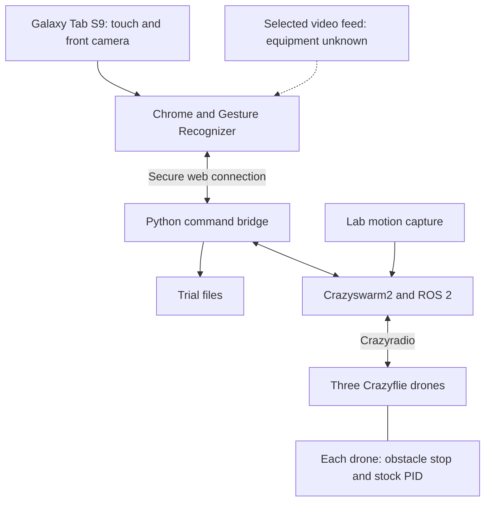

# Touch and vision drone control

This project will provide a tablet application for one operator to control three Crazyflie 2.1 drones indoors.
The application combines touch positioning, hand gestures for altitude control, a live map, onboard video, and trial records. [[1]](CONTEXT.md)

## Current status

The project is in planning. This repository contains documentation but no application code, dependency definitions, lockfiles, or automated tests.
There is no runnable application yet. The repository contains no hardware compatibility or flight-performance test results.

This README describes the planned software architecture, setup needs, dependencies, development steps, and tests.
[CONTEXT.md](CONTEXT.md) defines the thesis requirements, accepted decisions, evaluation method, and glossary.

## Planned architecture

The browser reads touch input and the front camera. MediaPipe returns gesture labels and hand landmarks, including the wrist position. [[2]](https://ai.google.dev/edge/mediapipe/solutions/vision/gesture_recognizer/web_js)
The Python command bridge connects browser input to flight commands. It checks input, maintains movement targets, and records trial data.
Crazyswarm2 connects the flight host to the drones and motion capture. [[3]](https://imrclab.github.io/crazyswarm2/installation.html)

| Language | Planned responsibility |
|---|---|
| TypeScript, HTML, CSS | Browser input, map, gestures, and display. The project chose TypeScript and no UI framework in [DEC-09 and DEC-10](CONTEXT.md#accepted-decisions-made-after-the-proposal). |
| Python 3.12 | Command checks, movement targets, trial records, and analysis. |
| C | Additional onboard obstacle-stop firmware. |
| C++ | The existing Crazyswarm2 backend. No new radio implementation is planned. |

The runtime plan uses local model and browser files. It does not require cloud inference.
The front camera reads the hand. Motion capture measures drone positions. The selected video feed needs separate onboard camera equipment.

## Setup and usage

Installation and launch commands are not available yet. Setup instructions will follow the first runnable build and dependency definitions.
The planned environments have these roles:

| Environment | Purpose and setup needs |
|---|---|
| Development computer | Use macOS, Windows, or Linux for the browser application and mock drone connection. |
| Tablet | Target Chrome for Android on the Galaxy Tab S9 specified in [DEC-01 and DEC-02](CONTEXT.md#accepted-decisions-made-after-the-proposal). Record the browser version during device tests. |
| Flight host | Use native Ubuntu with ROS 2 and Crazyswarm2, as accepted in [REC-01](CONTEXT.md#accepted-decisions-made-after-the-proposal). Select the computer and processor architecture after checking the tracking software development kit (SDK). |
| Tracking and radio | Record the motion-capture vendor, installed software, SDK version, protocol, and laboratory computer. Identify the USB radio model and firmware. |
| Onboard video | Identify each camera, receiver, firmware, and stream format before selecting video software. Check payload, deck fit, and power requirements. |

The [decision register](CONTEXT.md#accepted-decisions-made-after-the-proposal) records accepted equipment choices and unresolved compatibility checks.
The dependency table below lists candidates for implementation.

## Version recommendations

The team checked these versions on **23 September 2026** against official registries and release pages. They remain uninstalled and untested in this project.
Each version shows its release date. The Git row keeps its 17 September 2026 check date. Before adopting a candidate, check its release record and compatibility with the selected equipment.
Ubuntu 24.04 and Python 3.12 identify version families. The build record must include their installed patch versions.
WASM means WebAssembly, a format for code that browsers run.
A SHA-256 checksum identifies file contents. A lockfile records exact dependency versions.

### Stack summary

This table gives one choice for each layer of the stack. The next table gives the versions.

| Layer | Choice | Status |
|---|---|---|
| Web app | TypeScript, Vite, Canvas 2D, and Pointer Events, with no UI framework. Vitest runs the unit tests. | TypeScript and no framework are [DEC-09 and DEC-10](CONTEXT.md#accepted-decisions-made-after-the-proposal). The tools are recommendations. |
| Gestures | MediaPipe Gesture Recognizer in a web worker, with the pinned float16 model below | [DEC-06](CONTEXT.md#accepted-decisions-made-after-the-proposal). The web worker is a recommendation. |
| Tablet to host | JSON messages over WebSocket, on HTTPS and WSS, with mkcert certificates. No message library. | [protocol/README.md](protocol/README.md) defines the messages. The software team accepted them as [DEC-11](CONTEXT.md#accepted-decisions-made-after-the-proposal). Hardware team review is pending. The transport tools are recommendations. |
| Command bridge | Python 3.12, uv, aiohttp, Pydantic, pytest, and pytest-aiohttp | Recommendation. |
| Flight host | Ubuntu 24.04, ROS 2 Jazzy, and Crazyswarm2 | [REC-01](CONTEXT.md#accepted-decisions-made-after-the-proposal), accepted 23 September 2026. The host computer is an open question. |
| Motion capture | OptiTrack Motive, read through motion_capture_tracking | The lab system is OptiTrack Motive ([DEC-16](CONTEXT.md#accepted-decisions-made-after-the-proposal)). motion_capture_tracking lists OptiTrack support. [[4]](https://github.com/IMRCLab/motion_capture_tracking) The Motive version and streaming settings are still open ([OPEN-08](CONTEXT.md#unknowns-contradictions-and-open-decisions)). |
| Drone firmware | Crazyflie firmware plus custom C obstacle stop, built with the Ubuntu 24.04 ARM compiler | [DEC-05](CONTEXT.md#accepted-decisions-made-after-the-proposal). The compiler choice is a recommendation. |
| Video feed | Unknown | Open question ([OPEN-09](CONTEXT.md#unknowns-contradictions-and-open-decisions)). |
| Trial records | CSV and JSON files, written with the Python standard library | Recommendation. |

### Versions

| Component | Recorded recommendation | Purpose or unresolved limit |
|---|---|---|
| Flight host | Ubuntu 24.04 LTS (2024-04-25), preferably x86-64 | Motion-capture SDK requirements can constrain the processor choice. [[3]](https://imrclab.github.io/crazyswarm2/installation.html) [[4]](https://github.com/IMRCLab/motion_capture_tracking) [[47]](https://changelogs.ubuntu.com/meta-release-lts) |
| Robotics framework | ROS 2 Jazzy Jalisco (2024-05-23, end of life May 2029) | It connects the flight components. [[5]](https://docs.ros.org/en/jazzy/Releases.html) |
| Application language | Python 3.12 (3.12.0 released 2023-10-02) | The ROS environment needs a matching system interpreter. [[3]](https://imrclab.github.io/crazyswarm2/installation.html) [[6]](https://github.com/ros2/ros2_documentation/blob/jazzy/source/How-To-Guides/Using-Python-Packages.rst) [[48]](https://www.python.org/downloads/release/python-3120/) |
| Drone control | Crazyswarm2 1.0.7 (2026-08-21), ROS package `ros-jazzy-crazyflie` 1.0.7-1 (built 2026-09-03), C++ backend | This replaces the original Crazyswarm recommendation. The ROS apt repository serves this package for Ubuntu 24.04. [[7]](https://github.com/IMRCLab/crazyswarm2/releases/tag/1.0.7) [[8]](https://github.com/ros2-gbp/crazyswarm2-release) [[43]](http://packages.ros.org/ros2/ubuntu/dists/noble/main/binary-amd64/Packages.gz) |
| Tracking bridge | motion_capture_tracking 1.0.9 (2026-06-29), ROS package `ros-jazzy-motion-capture-tracking` 1.0.9-1 (built 2026-09-03) | The 17 September record named 1.0.6-1. The ROS distribution file and apt repository now give 1.0.9-1. The final choice depends on laboratory equipment. [[4]](https://github.com/IMRCLab/motion_capture_tracking) [[9]](https://github.com/ros/rosdistro/blob/master/jazzy/distribution.yaml) [[43]](http://packages.ros.org/ros2/ubuntu/dists/noble/main/binary-amd64/Packages.gz) |
| Web server | aiohttp 3.14.3 (2026-07-23) | It serves files and exchanges command messages. [[10]](https://pypi.org/project/aiohttp/) |
| Browser interface | TypeScript 6.0.3 (2026-04-16), HTML, CSS, ES modules, Canvas 2D, Pointer Events | TypeScript 7.0.2 (2026-07-08) is newer, but it has no programmatic API before 7.1. Vite's own TypeScript starter pins `~6.0.2`. Upgrade after 7.1. [[37]](https://registry.npmjs.org/typescript/6.0.3) [[38]](https://devblogs.microsoft.com/typescript/announcing-typescript-7-0-rc/) [[39]](https://github.com/vitejs/vite/blob/main/packages/create-vite/template-vanilla-ts/package.json) [[11]](https://developer.mozilla.org/en-US/docs/Web/API/Pointer_events/Using_Pointer_Events) |
| Message format | JSON text messages with no extra library, version 1 in [protocol/README.md](protocol/README.md) | TypeScript types describe messages in the browser. Pydantic models check them in the bridge. Both test suites load the shared [example messages](protocol/examples/) to catch differences. |
| Gesture package | @mediapipe/tasks-vision 1.0.1 (2026-07-31) | Use the built-in Gesture Recognizer. The package includes its TypeScript types. [[12]](https://registry.npmjs.org/@mediapipe%2ftasks-vision/1.0.1) [[2]](https://ai.google.dev/edge/mediapipe/solutions/vision/gesture_recognizer/web_js) |
| Gesture model | `gesture_recognizer.task`, float16, version 1 (file dated 2023-04-26), with the matching 1.0.1 WASM files | Download from the versioned path, not `latest`. Size: 8,373,440 bytes. SHA-256: `97952348cf6a6a4915c2ea1496b4b37ebabc50cbbf80571435643c455f2b0482`. On 23 September 2026, `latest` served the same file. [[40]](https://storage.googleapis.com/mediapipe-models/gesture_recognizer/gesture_recognizer/float16/1/gesture_recognizer.task) [[13]](https://ai.google.dev/edge/mediapipe/solutions/vision/gesture_recognizer) |
| Frontend build | Vite 8.3.0 (2026-09-10) and Node.js 24.21.0 LTS (2026-09-08) | Vite converts TypeScript to JavaScript but does not check types. Run `tsc` before `vite build`, as the Vite starter does. The Node.js blog gives 2026-09-08. The [download index](https://nodejs.org/dist/index.json) gives 2026-09-07. [[14]](https://registry.npmjs.org/vite/8.3.0) [[15]](https://nodejs.org/en/blog/release/v24.21.0) [[41]](https://vite.dev/guide/features#typescript) |
| Web unit tests | Vitest 5.0.1 (2026-09-15) | It supports Vite 8 and Node.js 24. Use its Node environment until a part needs browser DOM tests. [[42]](https://registry.npmjs.org/vitest/5.0.1) |
| Local certificates | mkcert 1.4.4 (2022-04-26), unless the laboratory supplies trusted certificates | Camera access needs a secure context and tablet trust. [[16]](http://developer.mozilla.org/en-US/docs/Web/API/MediaDevices/getUserMedia) [[17]](https://github.com/FiloSottile/mkcert/releases) [[18]](https://github.com/FiloSottile/mkcert) |
| Python dependencies | uv 0.12.18 (2026-09-22) | Record application dependencies in a lockfile. [[19]](https://pypi.org/project/uv/) [[20]](https://docs.astral.sh/uv/concepts/projects/layout/) |
| Input checks | Pydantic 2.13.5 (2026-08-28) | Check command fields and configuration at the input boundary. [[21]](https://pypi.org/pypi/pydantic/json) [[22]](https://docs.pydantic.dev/latest/api/config/) |
| Flight firmware | Crazyflie STM32 2026.08 (2026-08-20) plus the project firmware commit | The project still needs custom obstacle-stop logic. [[23]](https://github.com/bitcraze/crazyflie-firmware/releases/tag/2026.08) |
| Firmware compiler | `gcc-arm-none-eabi` 13.2.rel1 from Ubuntu 24.04 (package 15:13.2.rel1-2, 2024-02-22), with `make` | Bitcraze supports version 10.3 and newer. This version applies only if the firmware builds on the Ubuntu 24.04 flight host. [[44]](https://www.bitcraze.io/documentation/repository/crazyflie-firmware/master/building-and-flashing/build/) [[45]](https://launchpad.net/ubuntu/noble/+source/gcc-arm-none-eabi) |
| Onboard radio firmware | Crazyflie nRF 2026.08 (2026-08-20) | This differs from the USB radio firmware. [[24]](https://github.com/bitcraze/crazyflie2-nrf-firmware/releases/tag/2026.08) |
| USB radio firmware | Crazyradio 2.0: 5.5 (2026-06-03), or Crazyradio PA: 0.53 (2015-01-07) | The 17 September record named 5.4. Select only after identifying the physical radio. [[25]](https://github.com/bitcraze/crazyradio2-firmware/releases/tag/5.5) [[26]](https://github.com/bitcraze/crazyradio-firmware/releases) |
| Setup client | cfclient 2026.8 (2026-08-20) | It supports firmware setup and diagnostics. [[27]](https://www.bitcraze.io/2026/08/release-2026-08) |
| Conditional radio library | cflib 0.1.33 (2026-08-20) | Use it only with the Python backend. The recommended command transport uses C++. [[3]](https://imrclab.github.io/crazyswarm2/installation.html) [[27]](https://www.bitcraze.io/2026/08/release-2026-08) |
| Analysis | NumPy 2.5.3 (2026-09-06), SciPy 1.18.1 (2026-08-21), Matplotlib 3.11.2 (2026-09-11) | Use a separate Python 3.12 environment. Compatibility between these dependencies still needs a check. [[28]](https://pypi.org/project/numpy/) [[29]](https://pypi.org/project/scipy/) [[30]](https://pypi.org/project/matplotlib/) |
| Python tests | pytest 9.1.1 (2026-06-19) and pytest-aiohttp 1.1.1 (2026-06-07) | pytest-aiohttp runs the bridge WebSocket tests in roadmap part 1. [[31]](https://pypi.org/project/pytest/) [[46]](https://pypi.org/project/pytest-aiohttp/) |
| Browser automation | Optional Playwright 1.63.0 (2026-09-04) | Browser automation does not replace physical tablet tests. [[32]](https://registry.npmjs.org/@playwright%2ftest/latest) |
| Trial storage | Python standard library, CSV and JSON | The plan does not need a database server. |
| Version control | Existing supported Git 2.x (checked 2026-09-17) | This project does not require an upgrade for setup. [[33]](https://git-scm.com/downloads) |

The Multiranger Push demo is reference code with different dependencies. It does not establish a working stop for this setup. [[34]](https://github.com/bitcraze/crazyflie-demos/tree/main/demos/firmware/multiranger_push)
Video software remains unresolved until the camera format is known. No FFmpeg, GStreamer, OpenCV, or WebRTC choice is accepted.

### Open stack questions

Each owner comes from the [ROADMAP.md software parts](ROADMAP.md#software-parts). The team must answer these questions. Do not guess the answers.

| Question | Owner | Needed by | Label |
|---|---|---|---|
| Which computer is the flight host, and what is its processor architecture? | Hardware team (roadmap part 4) | 2026-10-02 | [OPEN-08](CONTEXT.md#unknowns-contradictions-and-open-decisions) |
| The lab uses OptiTrack Motive ([DEC-16](CONTEXT.md#accepted-decisions-made-after-the-proposal)). Which Motive version and streaming settings does it use? motion_capture_tracking supports VICON, Qualisys, OptiTrack, VRPN, NOKOV, FZMotion, and Motion Analysis. [[4]](https://github.com/IMRCLab/motion_capture_tracking) | Hardware team with lab staff (roadmap part 4) | 2026-10-02 | [OPEN-08](CONTEXT.md#unknowns-contradictions-and-open-decisions) |
| Which USB radio does the lab have: Crazyradio 2.0 or Crazyradio PA? | Hardware team (roadmap part 4) | 2026-10-02 | [OPEN-08](CONTEXT.md#unknowns-contradictions-and-open-decisions) |
| Which computer builds and flashes the firmware? Does the Ubuntu 24.04 compiler build it? | Roadmap part 5 owner. The owner is open. Assign an owner in Week 4. | 2026-10-18 | [DEC-05](CONTEXT.md#accepted-decisions-made-after-the-proposal) |
| Which onboard camera, receiver, and stream format supply the video feed? | Software team (roadmap part 6) | 2026-10-18 | [OPEN-09](CONTEXT.md#unknowns-contradictions-and-open-decisions) |
| Which Chrome version runs on the tablet? | Software team. Record it during the first tablet test. | First tablet test | [DEC-02](CONTEXT.md#accepted-decisions-made-after-the-proposal) |

## Development approach

The recommended design keeps application code portable and puts ROS integration in a separate drone connection.
A mock connection supplies synthetic positions on development computers. The flight connection uses Crazyswarm2 on the native Ubuntu host.

[ROADMAP.md](ROADMAP.md) gives the PRO2 order, dates, and exit checks for each software part.

The first software milestone connects tablet touch input to checked commands and returned mock positions.
It includes separate finger contacts, deliberate gesture activation, release behavior, and trial events.
The first hardware milestone uses one drone, motion capture, and repeatable position commands.

1. Complete the equipment inventory under [Setup and usage](#setup-and-usage) before selecting hardware-dependent software.
2. Define command fields, units, and browser/host responsibilities. Resolve behavior questions against [CONTEXT.md](CONTEXT.md#unknowns-contradictions-and-open-decisions). [protocol/README.md](protocol/README.md) records version 1.
3. Build the mock path and check the tablet camera, three touch contacts, map, and gestures together.
4. Check one-drone position control and onboard stopping before three-drone flights.
5. Add onboard video and check feed selection with touch and gestures active.
6. Complete the [testing plan](#testing) and record exact dependencies before participant trials.

### Implementation recommendations

Pydantic field checks do not replace checks for command age, flight states, position limits, or onboard stopping.
Use strict types, explicit field constraints, `extra='forbid'`, and `allow_inf_nan=False`. [[22]](https://docs.pydantic.dev/latest/api/config/)
ROS Python packages need a compatible interpreter. uv manages application dependencies but does not replace ROS installation tools. [[6]](https://github.com/ros2/ros2_documentation/blob/jazzy/source/How-To-Guides/Using-Python-Packages.rst)

Use a web worker, a background browser task, to keep gesture recognition separate from interface input. Check this on the tablet. [[2]](https://ai.google.dev/edge/mediapipe/solutions/vision/gesture_recognizer/web_js)
The recorded Crazyswarm2 interface uses `cmdPosition` for streamed targets. `goTo` has different movement behavior. [[35]](https://github.com/IMRCLab/crazyswarm2/blob/main/crazyflie_py/crazyflie_py/crazyflie.py)
The recorded simulator lacks `cmd_position` support. The mock checks application behavior with synthetic positions. [[36]](https://imrclab.github.io/crazyswarm2/overview.html)

### Build records

Record lockfiles, OS and ROS package revisions, source commits, firmware hashes, model checksums, browser versions, and configuration.
Identify the equipment in each calibration record. Setup commands will follow application development.

## Testing

No application tests exist yet. The implementation needs three levels of checks:

- Use the mock connection to check command fields, limits, input state, and trial records against the [control requirements](CONTEXT.md#required-interactions-and-control-behavior).
- Use the physical tablet to check camera access, three touch contacts, gestures, and video together.
- Use equipped drones and motion capture to measure flight stability, stopping distance, radio behavior, and physical response latency.

The [evaluation plan](CONTEXT.md#evaluation-method-and-numerical-targets) defines the study procedure, numerical targets, and scoring rules.
Record commands, equipment, dependency versions, results, and limitations for each test run.

Before each commit and pull request, stage the change and run `python3 scripts/check.py`. The script needs Python 3.10 or later and no packages.
It checks ignored files, possible secrets, local links and anchors, the example messages, and changed Mermaid diagrams.
After their configuration files exist, it also runs pytest, `tsc`, and Vitest. [AGENTS.md](AGENTS.md#before-delivery) lists the checks that need judgment.

## Interface mockup

A clickable design mockup of the tablet interface is at [jaz-villanueva/Thesis-UI-Mockup](https://github.com/jaz-villanueva/Thesis-UI-Mockup), published at <https://jaz-villanueva.github.io/Thesis-UI-Mockup/>.
It is a design prototype, not application code ([DEC-18](CONTEXT.md#accepted-decisions-made-after-the-proposal)). It simulates the flight host, the drones and the Multi-ranger readings in the browser.
It runs the pinned Gesture Recognizer files from its own copy.

## Project documentation

- Read [CONTEXT.md](CONTEXT.md) for the thesis purpose, requirements, decisions, open questions, and glossary.
- Read [ROADMAP.md](ROADMAP.md) for the PRO2 software timeline.
- Read [protocol/README.md](protocol/README.md) for the messages between the tablet and the host.
- Read [AGENTS.md](AGENTS.md) for instructions that apply to agents changing this repository.

Optional local research and proposal exports live in the ignored `.local/` folder. Shared development does not require those files.
Personal communication and writing preferences live in `.local/AGENTS.personal.md`, when present.

## References

The software source checks date to 17 September 2026. The team repeated the release checks on 23 September 2026, except for the Git source.
Moving branches and package pages support research claims. Record fixed revisions separately for the build.

1. [Thesis requirements and project decisions, recorded 17 September 2026](CONTEXT.md). This reference includes proposal sources and review limits.
2. [MediaPipe Gesture Recognizer web guide, undated](https://ai.google.dev/edge/mediapipe/solutions/vision/gesture_recognizer/web_js).
3. [Crazyswarm2 installation, undated](https://imrclab.github.io/crazyswarm2/installation.html).
4. [motion_capture_tracking documentation, undated](https://github.com/IMRCLab/motion_capture_tracking).
5. [ROS 2 distributions and support dates, Jazzy released 2024-05-23, checked 2026-09-23](https://docs.ros.org/en/jazzy/Releases.html).
6. [ROS 2 Jazzy Python package guidance, undated](https://github.com/ros2/ros2_documentation/blob/jazzy/source/How-To-Guides/Using-Python-Packages.rst).
7. [Crazyswarm2 1.0.7, 2026-08-21](https://github.com/IMRCLab/crazyswarm2/releases/tag/1.0.7).
8. [Crazyswarm2 ROS release records, 2026-08-21](https://github.com/ros2-gbp/crazyswarm2-release).
9. [ROS 2 Jazzy distribution file, motion_capture_tracking 1.0.9-1, checked 2026-09-23](https://github.com/ros/rosdistro/blob/master/jazzy/distribution.yaml).
10. [aiohttp 3.14.3 on PyPI, 2026-07-23](https://pypi.org/project/aiohttp/).
11. [MDN multi-touch Pointer Events example, undated](https://developer.mozilla.org/en-US/docs/Web/API/Pointer_events/Using_Pointer_Events).
12. [MediaPipe Tasks Vision 1.0.1 registry metadata, 2026-07-31, checked 2026-09-23](https://registry.npmjs.org/@mediapipe%2ftasks-vision/1.0.1).
13. [MediaPipe Gesture Recognizer model guide, undated](https://ai.google.dev/edge/mediapipe/solutions/vision/gesture_recognizer).
14. [Vite 8.3.0 registry metadata, 2026-09-10, checked 2026-09-23](https://registry.npmjs.org/vite/8.3.0).
15. [Node.js 24.21.0 LTS, 2026-09-08](https://nodejs.org/en/blog/release/v24.21.0).
16. [MDN getUserMedia secure-context requirements, undated](http://developer.mozilla.org/en-US/docs/Web/API/MediaDevices/getUserMedia).
17. [mkcert 1.4.4 release, 2022-04-26, checked 2026-09-23](https://github.com/FiloSottile/mkcert/releases).
18. [mkcert mobile trust instructions, undated](https://github.com/FiloSottile/mkcert).
19. [uv 0.12.18 on PyPI, 2026-09-22](https://pypi.org/project/uv/).
20. [uv project files and lockfile, undated](https://docs.astral.sh/uv/concepts/projects/layout/).
21. [Pydantic 2.13.5 release metadata, 2026-08-28](https://pypi.org/pypi/pydantic/json).
22. [Pydantic model configuration, checked 17 September 2026](https://docs.pydantic.dev/latest/api/config/).
23. [Crazyflie STM32 firmware 2026.08, 2026-08-20](https://github.com/bitcraze/crazyflie-firmware/releases/tag/2026.08).
24. [Crazyflie nRF firmware 2026.08, 2026-08-20](https://github.com/bitcraze/crazyflie2-nrf-firmware/releases/tag/2026.08).
25. [Crazyradio 2.0 firmware 5.5, 2026-06-03](https://github.com/bitcraze/crazyradio2-firmware/releases/tag/5.5).
26. [Crazyradio PA firmware releases, 0.53 dated 2015-01-07, checked 2026-09-23](https://github.com/bitcraze/crazyradio-firmware/releases).
27. [Bitcraze coordinated release, 2026-08-24](https://www.bitcraze.io/2026/08/release-2026-08).
28. [NumPy 2.5.3, 2026-09-06](https://pypi.org/project/numpy/).
29. [SciPy 1.18.1, 2026-08-21](https://pypi.org/project/scipy/).
30. [Matplotlib 3.11.2, 2026-09-11](https://pypi.org/project/matplotlib/).
31. [pytest 9.1.1, 2026-06-19](https://pypi.org/project/pytest/).
32. [Playwright 1.63.0 registry metadata, 2026-09-04](https://registry.npmjs.org/@playwright%2ftest/latest).
33. [Git downloads, checked 2026-09-17](https://git-scm.com/downloads).
34. [Bitcraze Multiranger Push firmware demo, undated](https://github.com/bitcraze/crazyflie-demos/tree/main/demos/firmware/multiranger_push).
35. [Crazyswarm2 Python command API source, undated](https://github.com/IMRCLab/crazyswarm2/blob/main/crazyflie_py/crazyflie_py/crazyflie.py).
36. [Crazyswarm2 backend support table, undated](https://imrclab.github.io/crazyswarm2/overview.html).
37. [TypeScript 6.0.3 registry metadata, 2026-04-16](https://registry.npmjs.org/typescript/6.0.3). TypeScript 7.0.2 was published on 2026-07-08 ([registry metadata](https://registry.npmjs.org/typescript/7.0.2)).
38. [Announcing TypeScript 7.0 RC, Microsoft, 2026-06-18](https://devblogs.microsoft.com/typescript/announcing-typescript-7-0-rc/). It states that a stable programmatic API comes with 7.1 at the earliest.
39. [Vite vanilla TypeScript starter package file, checked 2026-09-23](https://github.com/vitejs/vite/blob/main/packages/create-vite/template-vanilla-ts/package.json).
40. [MediaPipe Gesture Recognizer float16 model, version 1, file dated 2023-04-26, downloaded 2026-09-23](https://storage.googleapis.com/mediapipe-models/gesture_recognizer/gesture_recognizer/float16/1/gesture_recognizer.task).
41. [Vite TypeScript features guide, checked 2026-09-23](https://vite.dev/guide/features#typescript).
42. [Vitest 5.0.1 registry metadata, 2026-09-15](https://registry.npmjs.org/vitest/5.0.1).
43. [ROS 2 apt package index for Ubuntu 24.04, packages built 2026-09-03, checked 2026-09-23](http://packages.ros.org/ros2/ubuntu/dists/noble/main/binary-amd64/Packages.gz).
44. [Bitcraze firmware build guide, undated, checked 2026-09-23](https://www.bitcraze.io/documentation/repository/crazyflie-firmware/master/building-and-flashing/build/).
45. [Ubuntu 24.04 gcc-arm-none-eabi package, 2024-02-22](https://launchpad.net/ubuntu/noble/+source/gcc-arm-none-eabi).
46. [pytest-aiohttp 1.1.1 on PyPI, 2026-06-07](https://pypi.org/project/pytest-aiohttp/).
47. [Ubuntu LTS release metadata, 24.04 released 2024-04-25, checked 2026-09-23](https://changelogs.ubuntu.com/meta-release-lts).
48. [Python 3.12.0 release page, 2023-10-02](https://www.python.org/downloads/release/python-3120/).
