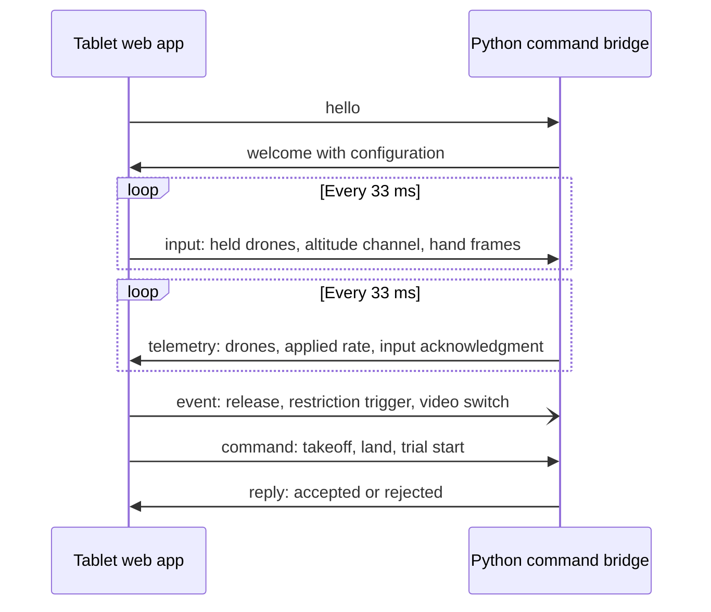

# Tablet and host messages

**Status: Version 1, accepted by the software team on 27 September 2026 as [DEC-11](../CONTEXT.md#accepted-decisions-made-after-the-proposal).** The hardware team must still review it. The [ROADMAP.md](../ROADMAP.md#decisions-that-block-work) deadline is 2026-09-28.
Placeholder values and the [open items](#open-items) remain open. The trial-record note is a recommendation.
No code implements these messages yet. No test has checked them.

This file owns the message fields, units, and limits between the tablet web app and the Python command bridge.
[CONTEXT.md](../CONTEXT.md) owns the behavior requirements. [README.md](../README.md) owns the software architecture.
The [examples](examples/) folder holds one example of each message. The planned test suites will load these files.

## Summary

The tablet and the host exchange JSON text messages over one secure WebSocket (`wss://`) for each client.
The tablet sends a complete input snapshot 30 times a second, even while the fingers are still. The host sends telemetry for all three drones 30 times a second.
Discrete events and commands travel between these snapshots on the same connection.

| Type | Direction | When | Purpose |
|---|---|---|---|
| `hello` | Tablet to host | First message on each connection | Identify the client, its role, and its version. |
| `welcome` | Host to tablet | Reply to `hello` | Start the session. Supply the course and limit configuration. |
| `input` | Tablet to host | Fixed rate, 30 Hz by default | Report held drones, horizontal placement targets, the altitude channel, and hand-camera frames. |
| `event` | Tablet to host | When it occurs | Record detail that the snapshots cannot show, such as a release reason or a restriction trigger. |
| `command` | Tablet to host | When the operator or experimenter asks | Request a discrete host action, such as takeoff or trial start. |
| `reply` | Host to tablet | After each `command`, or after an invalid message | Accept or reject a message, with a reason code. |
| `telemetry` | Host to tablet | Fixed rate, 30 Hz by default | Report measured and commanded state for each drone, the applied altitude rate, and the trial state. |
| `course` | Host to tablet | After a `layout_read` or `layout_apply` command | Send a course measured in Motive for review, or the course the host now uses. |

## Responsibilities

The tablet reports what the operator asks for. The host decides what the drones do.

| Concern | Tablet web app | Python command bridge |
|---|---|---|
| Horizontal placement | Reads each finger contact. Rejects drags that would bring a drone within the drone buffer of another drone at a similar height ([DEC-13](../CONTEXT.md#accepted-decisions-made-after-the-proposal)). Sends the accepted target of each held drone. | Checks each target again. Sets each held drone's horizontal target. |
| Restricted zone ([REQ-08](../CONTEXT.md#required-interactions-and-control-behavior)) | Rejects drags into the zone at all times and sends a restriction event. | Rejects any target inside the zone at all times, and counts restriction events only while a trial runs ([DEC-20](../CONTEXT.md#accepted-decisions-made-after-the-proposal)). |
| Altitude channel ([REQ-03 to REQ-06](../CONTEXT.md#required-interactions-and-control-behavior)) | Runs the gesture state machine. Captures the neutral point. Sends the state and the requested rate. | Applies the rate to each held drone's altitude target. Applies altitude limits and the [OPEN-03](../CONTEXT.md#unknowns-contradictions-and-open-decisions) rule. |
| Released drones ([REQ-07](../CONTEXT.md#required-interactions-and-control-behavior)) | Removes the drone from the held list. Sends the release kind and reason. | Sets the hover target of the released drone. The [OPEN-07](../CONTEXT.md#unknowns-contradictions-and-open-decisions) rule selects the measured or the last commanded position. |
| Setpoint stream ([TARGET-01](../CONTEXT.md#evaluation-method-and-numerical-targets)) | No role. | Streams setpoints to every airborne drone at 20 Hz or more, whether or not input arrives. |
| Trial state and time | Shows the trial state from telemetry. | Owns the trial clock and the trial records. |
| Selected video feed ([DEC-08](../CONTEXT.md#accepted-decisions-made-after-the-proposal)) | Selects the feed locally. Sends a `video_switch` event. | Records the event. The feed transport is unknown ([OPEN-09](../CONTEXT.md#unknowns-contradictions-and-open-decisions)). |

In the proposal, telemetry with Multi-ranger readings, battery level, and altitude returns over the same WebSocket for display and logging ([proposal](../CONTEXT.md#references) §1.7.3.7, PDF p. 42).
The tablet runs the gesture recognizer and sends only small values. It never sends video to the host.

This format does not cover the host-to-drone link, which uses Crazyswarm2. It also does not cover the video feed or the layout of trial files.

## Wire rules

- Send one JSON object in each WebSocket text message, encoded as UTF-8.
- Serve the page and the socket from the same HTTPS origin. Use the path `/ws`.
- Write field names in `snake_case`.
- Send every field in every message. Use `null` for "no value". No field is optional.
- Send finite numbers only. Python `json.dumps` writes `NaN` and `Infinity` by default, which are not valid JSON. Call it with `allow_nan=False`. [[1]](https://docs.python.org/3/library/json.html)
- Round lengths to 0.001 m and times to 0.1 ms.
- Every message starts with `type`, `v`, and `seq`. Tablet messages then give `t_ms`, and host messages give `host_ms`.
- `v` is the format version. This format is version `1`.
- Each sender numbers its own messages. `seq` starts at 1 on each connection and increases by 1 for each message of any type.

### Units

| Quantity | Unit | Notes |
|---|---|---|
| Position | meter | `x` and `y` are horizontal. `z` is height, positive up. |
| Altitude rate | m/s | Positive values climb. Negative values descend. |
| Time | millisecond | Field names end in `_ms`. |
| Yaw | degree | Counterclockwise from +x, from −180 to 180. |
| Range reading | meter | Multi-ranger distance. `null` when no valid reading exists. |
| Battery | volt | `battery_v`. |
| Hand-camera position | fraction of image width or height | MediaPipe normalizes landmark `x` and `y` by image width and height. The image `y` axis points down. [[2]](https://developers.google.com/edge/mediapipe/solutions/vision/hand_landmarker/web_js) |

### Coordinate frame

All positions use the frame in which the host commands the drones.
The laboratory motion-capture setup defines its origin. That setup is still unknown ([OPEN-08](../CONTEXT.md#unknowns-contradictions-and-open-decisions)).
The tablet does not hard-code the origin. It reads the room, capture volume, restricted zone, hoops, and obstacles from `welcome.config`.
Coordinates in the examples are illustrative. They are not measured positions.

### Clocks

- `t_ms` is the tablet clock. It is `performance.now()` in the page, not a trial-relative time.
- `touch_ms` is the `timeStamp` of the pointer event. It uses the same time origin as `performance.now()` in the page. [[3]](https://developer.mozilla.org/en-US/docs/Web/API/Event/timeStamp)
- A web worker has a different time origin. Take each hand-camera frame time on the page, when the page gives the frame to the worker.
- Each `host_*_ms` field is the host monotonic clock. The host owns the trial clock.
- Telemetry echoes the latest input. The tablet then calculates the round-trip time without an extra message:
  round trip = (telemetry arrival − `ack.t_ms`) − (`host_ms` − `ack.host_rx_ms`).
- The tablet sends its latest round-trip time in `input.rtt_ms`. The host estimates the clock offset from it for the trial records ([OPEN-12](../CONTEXT.md#unknowns-contradictions-and-open-decisions)).

## Messages

Each table gives the type, unit, and allowed values of each field. [Checks](#checks-and-responses) gives the host response to invalid values.

### `hello`

The tablet sends `hello` first on each connection. Example: [hello.json](examples/hello.json).

| Field | Type and allowed values | Meaning |
|---|---|---|
| `t_ms` | number, ≥ 0 | Tablet clock. |
| `role` | `operator` or `experimenter` | The host accepts `input` and `event` from one operator connection only. Both roles can send commands. |
| `client` | string | App name and build version. |
| `user_agent` | string | `navigator.userAgent`. It records the Chrome version for [DEC-02](../CONTEXT.md#accepted-decisions-made-after-the-proposal). |

### `welcome`

The host replies with `welcome`. The tablet sends nothing else until it arrives. Example: [welcome.json](examples/welcome.json).

| Field | Type and allowed values | Meaning |
|---|---|---|
| `host_ms` | number | Host clock. |
| `session` | string | Session identifier. Trial files use it. |
| `role` | `operator` or `experimenter` | The accepted role. |
| `config.id` | string | Version of the host configuration file. Trial records store it. |
| `config.drones` | array of strings | Crazyswarm2 drone names, for example `cf1`. |
| `config.input_hz`, `config.telemetry_hz` | number | Message rates. The default for both is 30. |
| `config.input_timeout_ms`, `config.telemetry_timeout_ms`, `config.stale_position_ms` | number | Timeouts. See [Timing and failures](#timing-and-failures). |
| `config.rate_max` | m/s | Maximum altitude rate. The value is a placeholder until bench tests ([OPEN-07](../CONTEXT.md#unknowns-contradictions-and-open-decisions)). |
| `config.z_min`, `config.z_max` | m | Flight altitude limits. The values are placeholders ([OPEN-01, OPEN-02](../CONTEXT.md#unknowns-contradictions-and-open-decisions)). |
| `config.zone_margin` | m | The tablet keeps accepted targets at least this distance outside the restricted zone. The value is a placeholder. |
| `config.course.room`, `.capture_volume`, `.restricted_zone` | rectangle `{x_min, x_max, y_min, y_max}` | Map extent, usable capture volume, and restricted zone. |
| `config.course.obstacles` | array of `{id, x_min, x_max, y_min, y_max, height}` | Physical obstacles O1 and O2. |
| `config.course.hoops` | array of `{id, x, y, z, diameter, plane, yaw}` | Hoops H1 to H3. `plane` is `horizontal` or `vertical`. |
| `config.course.pads` | array of `{id, x, y}` | Start position of each drone. |

### `input`

The tablet sends `input` from a fixed timer that is independent of screen drawing. Example: [input-three-drones-climbing.json](examples/input-three-drones-climbing.json).

| Field | Type and allowed values | Meaning |
|---|---|---|
| `t_ms` | number | Tablet clock when the tablet built the message. |
| `rtt_ms` | number or `null` | Latest round-trip time. `null` until the first telemetry arrives. |
| `held` | array of 0 to 3 entries | Every held drone, even when its finger is still. An empty array means that no drone is held. |
| `held[].id` | drone name from `config.drones` | Each name appears once. |
| `held[].x`, `held[].y` | m | Accepted horizontal placement target, after the restricted-zone check. |
| `held[].touch_ms` | number | `timeStamp` of the pointer event that gave this target. |
| `held[].follow` | boolean | `true` when the shared altitude rate applies to this drone. It is `true` until the team decides how a drone joins during active control. |
| `gesture.state` | `idle`, `confirming`, `active`, `locked`, `hand_loss`, or `unrecognized` | Altitude-channel state. `locked` is altitude lock. The host applies the rate only in `active`. The trial records use the other states. |
| `gesture.rate` | m/s, from −`rate_max` to `rate_max` | Requested shared rate after the dead zone and the maximum. It is 0 in every state except `active`. |
| `gesture.neutral_y` | 0 to 1, or `null` | Wrist height at activation. It is a number only in `active`. |
| `frames` | array of 0 to 10 entries | Each hand-camera frame that the recognizer processed since the previous `input`. |
| `frames[].t_ms` | number | Tablet clock when the page captured the frame. |
| `frames[].label` | MediaPipe category name, or `null` | For example `Open_Palm`, `Closed_Fist`, or `None`. `null` when no hand appears. |
| `frames[].score` | 0 to 1, or `null` | Classifier score for the label. It is not intended-command accuracy ([OPEN-12](../CONTEXT.md#unknowns-contradictions-and-open-decisions)). |
| `frames[].wrist_x`, `frames[].wrist_y` | number or `null` | Wrist landmark position in the image. The host does not clamp these values. |

The `frames` array gives the host every frame for [TARGET-02](../CONTEXT.md#evaluation-method-and-numerical-targets), [TARGET-06, TARGET-07](../CONTEXT.md#evaluation-method-and-numerical-targets), and the [REQ-17](../CONTEXT.md#evaluation-method-and-numerical-targets) sub-tests.
The camera rate differs from the input rate. For this reason, one `input` usually carries zero, one, or two frames. The limit of 10 covers a delayed timer.

### `event`

The tablet sends an `event` when it occurs. The held list stays the authority on which drones are held. Events add the detail that a snapshot cannot show.
Examples: [event-release-cancelled.json](examples/event-release-cancelled.json) and [event-restriction-start.json](examples/event-restriction-start.json).

| Field | Type and allowed values | Meaning |
|---|---|---|
| `t_ms` | number | Tablet clock when the event occurred. |
| `name` | a name from the table below | Event name. |
| `drone` | drone name or `null` | The drone that the event concerns. |
| `data` | object | Fields for this event name. |

| `name` | `data` fields |
|---|---|
| `release` | `kind`: `released` (finger lift), `cancelled` (pointer cancel), or `system`. `reason`: `null` unless `kind` is `system`. Then it is `link_lost`, `landing`, `estop`, `stale_position`, `page_hidden`, `host_lost`, or `grounded`. |
| `restriction_start` | `zone`, `finger {x, y}`, `candidate {x, y}`, `accepted {x, y}`. One episode for each drone, from zone entry to exit or release. |
| `restriction_end` | `zone`, `duration_ms`. |
| `capture_limit_start` | `finger {x, y}`, `accepted {x, y}`. The target reached the edge of the usable capture volume. This is not a restriction trigger. |
| `capture_limit_end` | `duration_ms`. |
| `touch_ignored` | `finger {x, y}`, `reason`: `not_holdable` or `already_held`. |
| `video_switch` | `from`, `to`: drone names or `null`. |
| `visibility` | `state`: `hidden` or `visible`. |

### `command` and `reply`

A `command` asks the host for a discrete action. The host answers every command with one `reply`. Examples: [command-takeoff.json](examples/command-takeoff.json) and [reply-rejected.json](examples/reply-rejected.json).

| Field | Type and allowed values | Meaning |
|---|---|---|
| `command.t_ms` | number | Tablet clock. |
| `command.name` | a name from the table below | Requested action. |
| `command.args` | object | Arguments for this command name. |
| `reply.host_ms` | number | Host clock. |
| `reply.ref` | integer or `null` | `seq` of the message that this reply answers. `null` when the host cannot read a `seq`. |
| `reply.ok` | boolean | `true` when the host accepted the message. |
| `reply.code` | `null`, `invalid`, `version`, `busy`, `unknown_drone`, or `not_allowed` | Reason for rejection. `null` when `ok` is `true`. |
| `reply.detail` | string or `null` | Explanation for the log and the experimenter. |

The command names are placeholders. The takeoff, landing, emergency-stop, and arming transitions are still open decisions ([CONTEXT.md](../CONTEXT.md#required-interactions-and-control-behavior), [OPEN-10](../CONTEXT.md#unknowns-contradictions-and-open-decisions)).

| `name` | `args` | Placeholder rule |
|---|---|---|
| `takeoff` | `drones`: array of drone names | Starts takeoff for grounded drones. |
| `land` | `drones`: array of drone names | Starts landing. |
| `stop` | `{}` | Emergency stop. Its effect and owner are open. |
| `stop_reset` | `{}` | Clears a stop. The host accepts it only when every drone is grounded. |
| `trial_start` | `trial_id`: string | Starts the trial clock and the trial file. The host rejects it with `not_allowed` unless every drone is grounded on its own start position, has a telemetry link, and the emergency stop is clear ([DEC-20](../CONTEXT.md#accepted-decisions-made-after-the-proposal)). |
| `trial_end` | `outcome`: `collision` or `hardware_abort` | The experimenter ends the trial for a collision the host did not detect, or voids it for a hardware fault. The host ends trials itself: `completed` when every drone has passed H1, H2 and H3 in order and is grounded on its own start position, `timeout` at the time limit, and `collision` when a drone reports `sys.isTumbled` ([DEC-20](../CONTEXT.md#accepted-decisions-made-after-the-proposal)). Hardware aborts stay separate from participant failures ([OPEN-13](../CONTEXT.md#unknowns-contradictions-and-open-decisions)). |
| `layout_read` | `{}` | Reads the marked rigid bodies from Motive ([DEC-16](../CONTEXT.md#accepted-decisions-made-after-the-proposal)) and sends a `course` message with `pending` set to `true`. The host rejects it with `not_allowed` while a trial runs or a drone is flying. |
| `health_check` | `{}` | Runs the Crazyflie propeller and battery tests (`health.startPropTest`, then `health.startBatTest`) on every drone ([DEC-21](../CONTEXT.md#accepted-decisions-made-after-the-proposal)). The host rejects it with `not_allowed` while a trial runs or a drone is flying. Results arrive in `drones[].health`. |
| `layout_apply` | `config_id`: string | Adopts the pending course with that `config_id`. The host sends a `course` message with `pending` set to `false`, and later trial records use it. |

### `telemetry`

The host sends `telemetry` from a fixed timer. Example: [telemetry-cf3-defensive-hover.json](examples/telemetry-cf3-defensive-hover.json).

| Field | Type and allowed values | Meaning |
|---|---|---|
| `host_ms` | number | Host clock when the host built the message. |
| `ack.seq`, `ack.t_ms` | integer and number, or `null` | `seq` and `t_ms` of the latest valid `input`. |
| `ack.host_rx_ms` | number or `null` | Host clock when that `input` arrived. |
| `trial` | `{id, running, elapsed_ms, outcome, hoops}` or `null` | The current or latest trial. `elapsed_ms` comes from the host trial clock. `outcome` is `null` while the trial runs, then `completed`, `collision`, `timeout`, or `hardware_abort`. `hoops` maps each drone to the number of hoops it has passed in order. |
| `altitude.rate` | m/s | The shared rate that the host applied at this tick. |
| `altitude.blocked_by` | drone name or `null` | A held drone that cannot follow the shared rate. |
| `altitude.reason` | `z_max`, `z_min`, `defensive_hover`, or `null` | The cause of the block. The response to a block is [OPEN-03](../CONTEXT.md#unknowns-contradictions-and-open-decisions). |
| `drones` | array, one entry for each drone in `config.drones` | Drone state. |
| `drones[].held` | boolean | `true` when the host applies a held entry for this drone. The host ignores held entries for drones that are not flying. |
| `drones[].state` | `grounded`, `taking_off`, `flying`, `landing`, or `stopped` | Flight state. |
| `drones[].link` | `ok` or `lost` | Radio link. |
| `drones[].x`, `.y`, `.z`, `.yaw` | m and degree, or `null` | Latest motion-capture pose. `null` before the first pose. |
| `drones[].pos_age_ms` | number or `null` | Age of that pose. The position is stale above `config.stale_position_ms`. |
| `drones[].cmd` | `{x, y, z}` in m | The host's current target for this drone. |
| `drones[].ranges` | `{front, back, left, right, up}` in m | Multi-ranger readings, relative to the drone body. |
| `drones[].defensive_hover` | `{dir, range}` or `null` | Onboard defensive hover. `dir` is a range direction. It depends on the onboard firmware reporting a flag ([DEC-05](../CONTEXT.md#accepted-decisions-made-after-the-proposal)). |
| `drones[].battery_v` | volt or `null` | Battery voltage. |
| `drones[].battery_level` | 0 to 90 in steps of 10, or `null` | Firmware `pm.batteryLevel`, from its LiPo charge curve. |
| `drones[].pm_state` | `battery`, `charging`, `charged`, `lowPower`, `shutDown`, or `null` | Firmware `pm.state`. `lowPower` follows 5 s below `pm.lowVoltage` (3.2 V by default). |
| `drones[].can_fly`, `drones[].tumbled` | boolean or `null` | Firmware `sys.canfly` and `sys.isTumbled`. |
| `drones[].health` | `{motor_pass, battery_sag_v, battery_pass, host_ms}` or `null` | Latest `health_check` result. `motor_pass` lists four booleans from `health.motorPass`, motors M1 to M4. `battery_sag_v` is `health.batterySag`. `battery_pass` is `true` when the sag is 0.70 V or less. `null` until a check runs. |
| `drones[].link_quality` | 0 to 100, or `null` | Share of radio packets acknowledged, in %. The tablet shows it as signal bars, as in Figure 1. `null` when the host has no value. |

## Timing and failures

- **Input rate.** The proposal requires the interface to stream position commands at a minimum of 20 Hz ([proposal](../CONTEXT.md#references) SO1, PDF p. 19). A 20 Hz timer has no margin for timer jitter. For this reason, the default input rate is 30 Hz. Measure it on the tablet.
- **Telemetry rate.** The default is 30 Hz. The host sends telemetry even when no input arrives.
- **Setpoint rate.** The host streams setpoints to every airborne drone at its own fixed rate of 20 Hz or more. Released drones also receive hover setpoints ([REQ-07](../CONTEXT.md#required-interactions-and-control-behavior)).
- **Stale input (placeholder for [OPEN-06](../CONTEXT.md#unknowns-contradictions-and-open-decisions)).** If no valid `input` arrives for `input_timeout_ms` (placeholder 300 ms), the host treats the held list as empty and the rate as 0. Every drone then holds its target.
- **Resume after stale input.** The host ignores held entries after a stale period. It accepts them again only after an `input` that has an empty held list and a gesture state other than `active`. This rule requires a new hold and a new activation.
- **Hidden page.** Chrome checks timers in a hidden page only once each second. After five minutes, the check can occur only once each minute. [[4]](https://developer.chrome.com/blog/timer-throttling-in-chrome-88) For this reason, the tablet releases all contacts on `visibilitychange` to hidden. It sets the altitude channel to `idle` and sends a final `input`.
- **Host loss.** If no telemetry arrives for `telemetry_timeout_ms` (placeholder 500 ms), the tablet releases every contact with reason `host_lost`. It also shows the loss.
- **Reconnection.** The tablet sends a new `hello`. `seq` starts again at 1. The operator must hold the drones again and activate the gesture again.

## Checks and responses

The bridge checks every received message with Pydantic models. The models use strict types, `extra='forbid'`, and `allow_inf_nan=False` ([README.md](../README.md#implementation-recommendations)).
The host sends at most one `reply` each second for each error code on the `input` stream. This limit prevents a flood of replies at 30 Hz.
The rectangle checks allow 0.001 m, one rounding step. A target within 0.001 m of an edge counts as on the allowed side. The tablet `zone_margin` keeps normal targets clear of this tolerance.

| Condition | Host response |
|---|---|
| The message is not a JSON object, or a field is missing, extra, or of the wrong type. | Reject the message. Reply `invalid`. |
| `v` is not 1. | Reply `version`. Close the connection. |
| The first message is not `hello`. | Reply `invalid`. Close the connection. |
| A second `operator` connects. | Reply `busy`. Close the new connection. |
| `seq` does not increase. | Reject the message. Reply `invalid`. |
| `input.t_ms` is less than the `t_ms` of the previous `input`. | Reject the `input`. Reply `invalid`. An `event` can carry an earlier `t_ms`, because `t_ms` is the time of occurrence. |
| `seq` skips a number. | Accept the message. Record the gap. |
| A drone name is not in `config.drones`, or a held name repeats. | Reject the message. Reply `unknown_drone` or `invalid`. |
| A held target lies outside the capture volume, or inside the restricted zone. | Ignore that entry. Keep the previous target of that drone. Reply `invalid`. Apply the other entries. |
| A held entry names a drone that is not flying. | Ignore the entry. Report `held: false` in telemetry. |
| `gesture.rate` is not 0 outside `active`, or its size exceeds `rate_max`. | Reject the `input`. Keep the previous targets. Reply `invalid`. |
| A command is not allowed in the current state. | Reply `not_allowed` with a detail. |

The tablet checks `type` and `v` on each received message. It ignores an unknown type and writes a console warning.

**Version changes.** Until the prototype freeze in Week 12, change a field in one commit. That commit updates this file, the examples, the TypeScript types, and the Pydantic models. After the freeze, increase `v` for any change.

**Trial records (recommendation).** The host can write each received and sent message to the trial file as one JSON line with its arrival time. Then each reported metric can use the raw messages ([OPEN-12](../CONTEXT.md#unknowns-contradictions-and-open-decisions)).

### `course`

The host sends `course` after `layout_read` and after `layout_apply`. Examples: [command-layout-read.json](examples/command-layout-read.json) and [course-pending.json](examples/course-pending.json).

| Field | Type and allowed values | Meaning |
|---|---|---|
| `host_ms` | number | Host clock. |
| `config_id` | string | Identifier of this course. `layout_apply` names it. Trial records store the adopted one. |
| `pending` | boolean | `true` for a measured course awaiting review. `false` for the course the host now uses. |
| `course` | object | Same fields as `welcome.config.course`, with positions measured in Motive and converted to the host frame. |
| `bodies_found`, `bodies_expected` | integer | Rigid bodies read, out of those configured. The tablet flags a missing body before `layout_apply`. |

## Changes from the earlier draft

The first draft, from 23 September 2026, was an earlier version of [input-three-drones-climbing.json](examples/input-three-drones-climbing.json). The mockup specification of 24 September 2026 followed it. This format changes these points:

1. `t_ms` is the page clock, not trial time. The host owns trial time.
2. `mode` moves from `input` to `telemetry`. The host owns the mode and rejects `set_mode` during a trial.
3. Held entries add `touch_ms` for latency onset and `follow` for the join rule.
4. The gesture state adds `confirming` and `unrecognized`. The trial records need them for unintended activations. `neutral_y` is new.
5. `frames` and `rtt_ms` are new.
6. Telemetry uses glossary names and measured units. `dh` becomes `defensive_hover`, `battery` becomes `battery_v`, and `stale` becomes `pos_age_ms`. `held`, `ack`, `altitude`, `mode`, and `trial` are new.
7. The earlier examples used two different origins, (1.20, 0.85) and (−1.45, −1.02). Both were illustrative. The host configuration now supplies the frame.

Changes staged on 27 September 2026, before the prototype freeze: `course`, `layout_read`, `layout_apply`, `health_check`, `drones[].link_quality`, `drones[].battery_level`, `drones[].pm_state`, `drones[].can_fly`, `drones[].tumbled` and `drones[].health` are new. `trial_start` has start conditions. `trial_end` now carries only `collision` or `hardware_abort`, because the host ends completed and timed-out trials itself. `trial.outcome` and `trial.hoops` are new. `mode` and `set_mode` are removed: the restricted zone applies at all times ([DEC-20](../CONTEXT.md#accepted-decisions-made-after-the-proposal)). Sessions and trials use short IDs such as `S1` and `S1-T2`. The example course follows proposal Figure 5, and the example altitude limits follow [DEC-15 and DEC-17](../CONTEXT.md#accepted-decisions-made-after-the-proposal).

## Open items

These decisions can change field values or rules. They do not need a new field.

| Item | Effect on this format | Owner |
|---|---|---|
| Motion-capture origin and axes ([OPEN-08](../CONTEXT.md#unknowns-contradictions-and-open-decisions)) | Motive streams a `y`-up frame by default. The host converts it to the `z`-up frame in meters before sending positions or a `course`. Record the Motive version and streaming settings. | Hardware team |
| Multi-ranger, battery, and defensive-hover telemetry over the radio | Confirm the rate at which these values reach the host for three drones. | Hardware team |
| Timeouts ([OPEN-06](../CONTEXT.md#unknowns-contradictions-and-open-decisions)) | Replace the placeholder values in `welcome.config`. | Both teams |
| Altitude limits and rate constants ([OPEN-01, OPEN-02, OPEN-07](../CONTEXT.md#unknowns-contradictions-and-open-decisions)) | Replace `z_min`, `z_max`, and `rate_max`. | Software team |
| Altitude block ([OPEN-03](../CONTEXT.md#unknowns-contradictions-and-open-decisions)) | Sets the host response to `altitude.blocked_by`. | Both teams |
| Joining during active control | Sets how the tablet fills `held[].follow`. | Software team |
| Takeoff, landing, stop, and arming | Replaces the placeholder command names. | Both teams |
| Latency events and clocks ([OPEN-12](../CONTEXT.md#unknowns-contradictions-and-open-decisions)) | Uses `touch_ms`, `frames[].t_ms`, and `rtt_ms`. | Both teams |

## References

Sources were checked on 27 September 2026.

1. [Python `json` module documentation, Python 3.14](https://docs.python.org/3/library/json.html).
2. [MediaPipe Hand Landmarker web guide, updated 2026-08-17](https://developers.google.com/edge/mediapipe/solutions/vision/hand_landmarker/web_js).
3. [MDN `Event.timeStamp`, undated](https://developer.mozilla.org/en-US/docs/Web/API/Event/timeStamp).
4. [Chrome timer throttling in Chrome 88, Chrome for Developers, 2021-01-18](https://developer.chrome.com/blog/timer-throttling-in-chrome-88).
